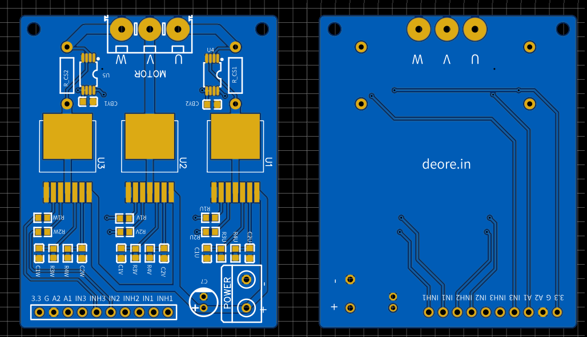
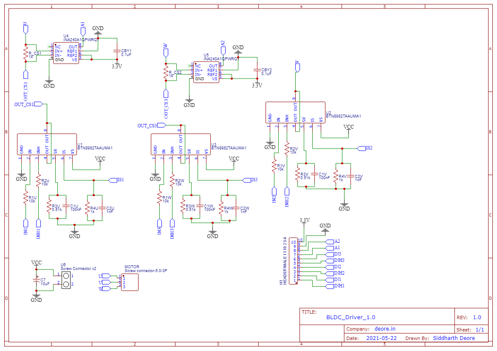

# BLDC Motor Dynamics and Control
Electric motor, commutation playground for three phase PMSM bldc motor

## Hardware
Schematic

PCB

## Motor Parameters

 Property | Variable | Value | Unit |
--- | --- | --- | ---
Viscous damping | B | 0.000052 | N-m/(rad/s) 
Rotor inertia | J | 0.0007 | Kg-m^2
Back-EMF constant | Ke | 0.0071 | V/rad/s
Torque constant | Kt | 0.0071 | N-m/A
Inductance | L | 0.005 | H
Number of Poles | P | 4 | -
Resistance | R | 3.25 | Ohm

## Field Oriented Control

### Example 1 : Angle Control

## Space Vector Control

### Example 2 : Velocity Tracking

